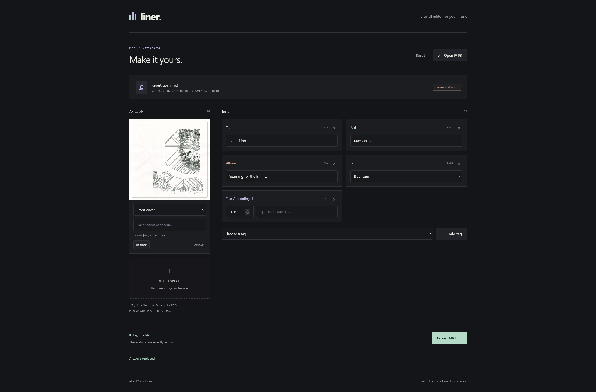

A browser-based editor for MP3 metadata and cover artwork. Files are processed locally and the audio stream is copied without re-encoding.

Use the free public version at [mp3.shrt.day](https://mp3.shrt.day).



## Features

- Read and write ID3v2.3 and ID3v2.4 tags
- Edit common fields, comments, lyrics, custom text, links, and ratings
- Add, replace, download, or remove cover artwork
- Preserve unsupported ID3 frames and APEv2 metadata
- Import ID3v1 metadata when opening older files
- Export changes as a new `.mp3` file

## Usage

Open or drop an MP3 into the editor, update its tags or artwork, then select **Export MP3**. The original file is not modified.

## Development

Install dependencies and start the development server:

```sh
npm install
npm run dev
```

Create a production build in `dist`:

```sh
npm run build
```
